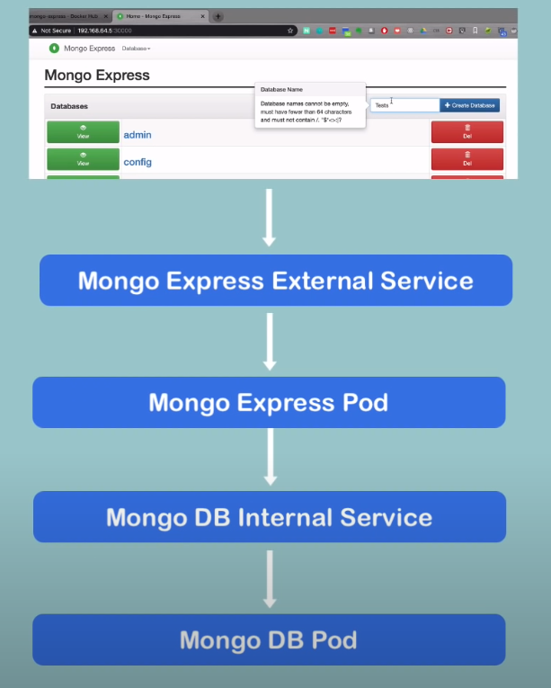
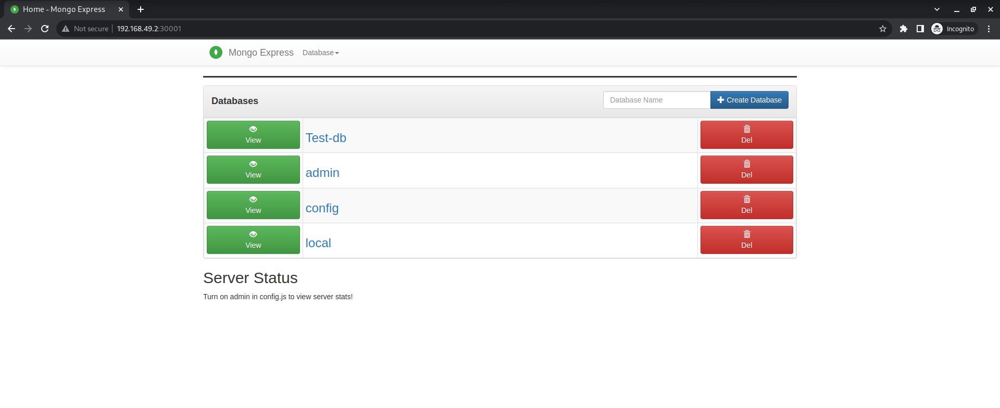

# k8s-mongo-project

This is my first K8s project. I made this to get some hands-on experience in Kubernetes and expand my knowledge in container orchestration.

## Prerequisites
1. [minikube](https://minikube.sigs.k8s.io/docs/start/)
2. [kubectl](https://kubernetes.io/docs/tasks/tools/)
3. [docker](https://docs.docker.com/get-docker/)

## Kubernetes Architecture


## How to run
1. Clone the repository
```bash
git clone https://github.com/0xt3j4s/k8s-mongo-project.git
```
2. Start minikube
```
minikube start
```
3. Create the secret
```
kubectl apply -f mongo-secret.yaml
```
4. Create the mongodb deployment and the internal service
```
kubectl apply -f mongo.yaml
```
5. Check the status
```
kubectl get all
```
6. Create the configmap
```
kubectl apply -f mongo-configmap.yaml
```
7. Create the mongo express pod and the external service
```
kubectl apply -f mongo-express.yaml
```
8. Check the status
```
kubectl get all
kubectl get service
```
9. Open the mongo express service
```
minikube service mongo-express-service
```
This is will generate the URL to access the mongo express service at the assigned `nodePort` (which is 30001 in this case).

10. Open the URL in your browser and you will see the mongo express UI.

## My outputs
- Created the secret:
    ```bash
    $ kubectl apply -f mongo-secret.yaml
    secret/mongo-secret created
    ```

- Confirmed using:
    ```bash
    $ kubectl get secret                
    NAME           TYPE     DATA   AGE
    mongo-secret   Opaque   2      15s
    ```

- Creating the mongodb deployment
    ```bash
    $ kubectl apply -f mongo.yaml       
    deployment.apps/mongo-deployment created
    ```

- Confirmed using:
    ```bash
    $ kubectl get pod         
    NAME                                READY   STATUS    RESTARTS   AGE
    mongo-deployment-845bcbf466-8v6bd   1/1     Running   0          48s
    ```

- Creating the internal service
    ```bash
    $ kubectl apply -f mongo.yaml
    deployment.apps/mongo-deployment unchanged
    service/mongodb-service created
    ```

Similarly Created the configmap and the mongo express pod and the external service.
- configmap:
    ```bash
    $ kubectl apply -f mongo-configmap.yaml
    configmap/mongodb-configmap created
    ```

- Mongo express pod:
    ```bash
    $ kubectl apply -f mongo-express.yaml  
    deployment.apps/mongo-express created
    ```

- External service:
    ```bash
    $ kubectl apply -f mongo-express.yaml    
    deployment.apps/mongo-express unchanged
    service/mongo-express-service created
    ```


Finally, opening the mongo express external service using `minikube`
```bash
minikube service mongo-express-service
|-----------|-----------------------|-------------|---------------------------|
| NAMESPACE |         NAME          | TARGET PORT |            URL            |
|-----------|-----------------------|-------------|---------------------------|
| default   | mongo-express-service |        8081 | http://192.168.49.2:30001 |
|-----------|-----------------------|-------------|---------------------------|
🎉  Opening service default/mongo-express-service in default browser...
``` 

The final service looks like this:

